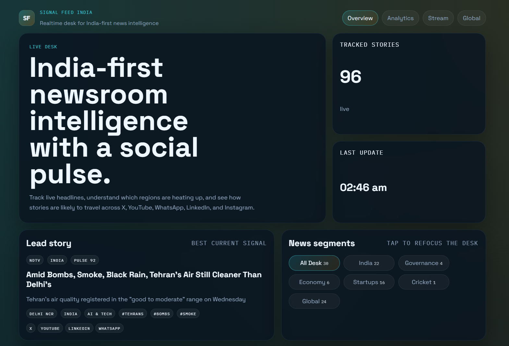
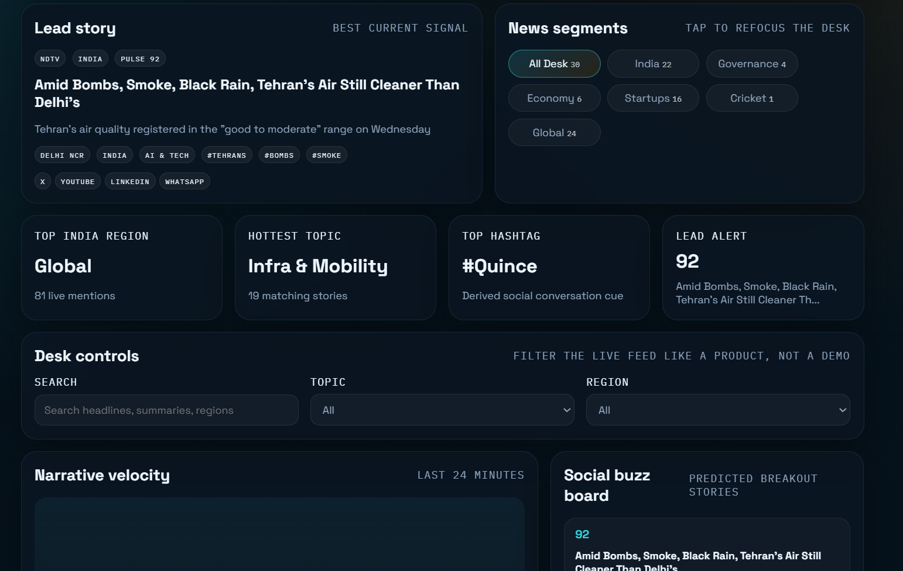
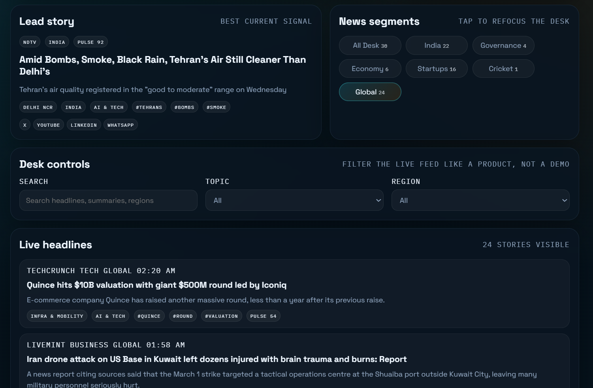
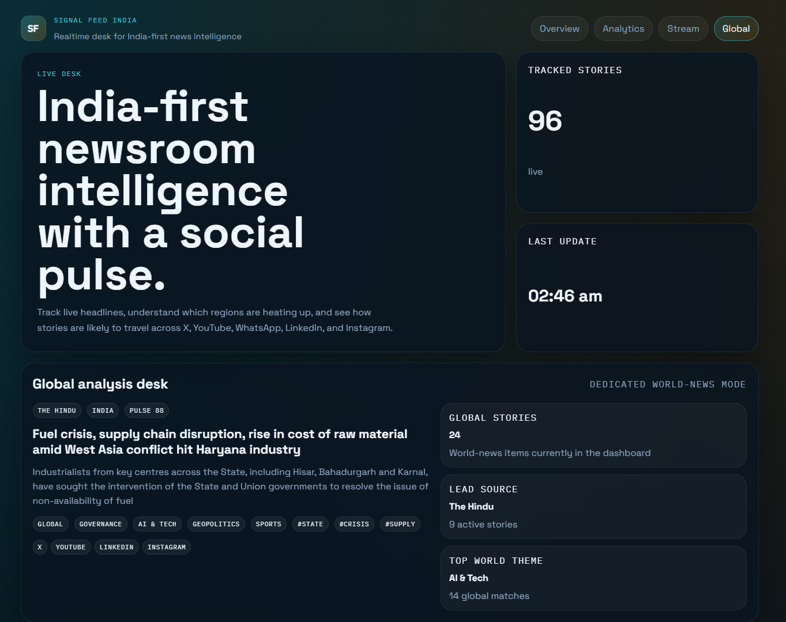
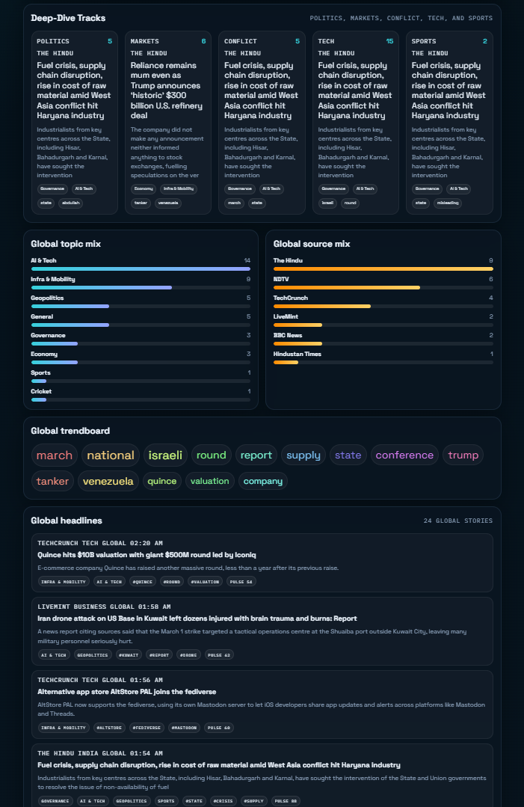
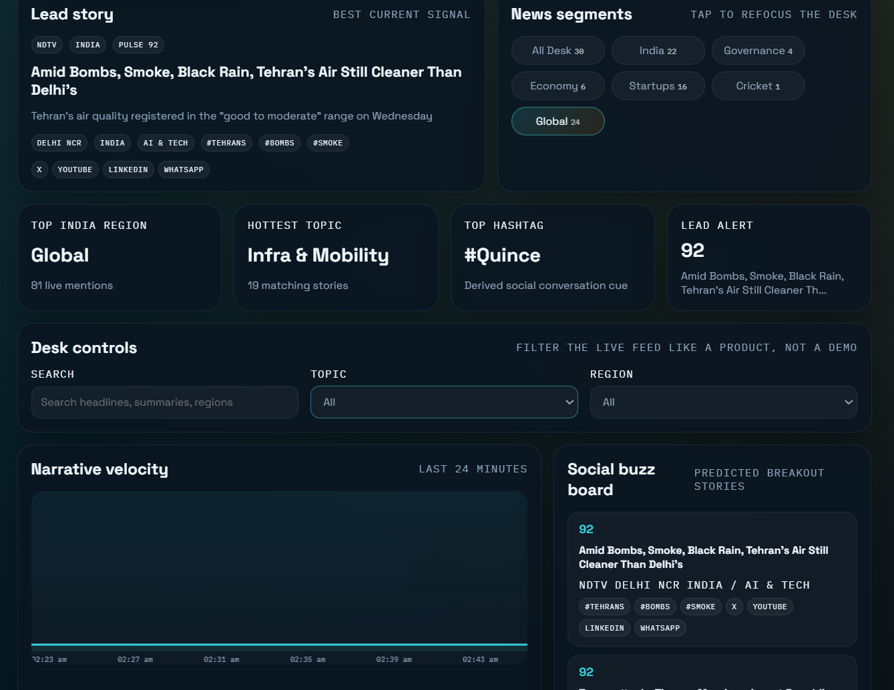

# Signal Feed India

Signal Feed India is a real-time news intelligence dashboard built with FastAPI, WebSockets, and a polished browser UI. It tracks Indian and global RSS coverage, organizes stories into useful editorial segments, estimates social momentum, and presents the stream in an operator-friendly dashboard.

## Highlights

- India-first live news desk with global analysis mode
- real-time snapshot updates over WebSockets
- segment switching for India, Governance, Economy, Startups, Cricket, and Global
- dedicated global dashboard with deep-dive cards for Politics, Markets, Conflict, Tech, and Sports
- topic, region, and keyword filtering for fast newsroom-style navigation
- derived social pulse, hashtag radar, source mix, and trendboards
- graceful fallback sample data when live RSS feeds are unavailable

## Screenshots

### Overview


### Analytics


### Stream


### Global Analysis


### Global Deep Dive


### Filters and Segments


## Tech Stack

- FastAPI
- Uvicorn
- aiohttp
- feedparser
- vanilla JavaScript
- HTML/CSS

## Features

### Live intelligence workflow
- Polls multiple Indian and global RSS sources asynchronously.
- Normalizes stories into a single live feed.
- Pushes fresh snapshots to the UI over WebSockets.

### Story enrichment
- Classifies stories into editorial categories such as Governance, Economy, Startups, Cricket, AI & Tech, and Geopolitics.
- Detects regional relevance for India-focused coverage.
- Generates hashtag cues and a social pulse score to estimate breakout potential.

### Product UI
- Overview, Analytics, Stream, and Global dashboard modes.
- Lead-story spotlight and social buzz board.
- Deep-dive global analysis cards for major world-news lanes.
- Search, topic filter, region filter, and one-tap segment toggles.

## Project Structure

```text
app/
  classifier.py
  config.py
  feeds.py
  main.py
  models.py
  store.py
static/
  app.js
  index.html
  styles.css
docs/
  screenshots/
requirements.txt
README.md
```

## Getting Started

### 1. Install dependencies

```powershell
pip install -r requirements.txt
```

### 2. Run the app

```powershell
python -m uvicorn app.main:app --reload
```

Open [http://127.0.0.1:8000](http://127.0.0.1:8000).

## API Endpoints

- `GET /api/health`
- `GET /api/snapshot`
- `GET /api/headlines?topic=India`
- `GET /api/headlines?region=Delhi%20NCR`
- `GET /api/headlines?q=startup`
- `GET /ws`

## Notes

- The current social layer is modeled from story signals rather than direct X/Reddit/YouTube ingestion.
- If RSS feeds are unavailable, the dashboard falls back to sample stories so the UI remains testable.
- The next logical extension is persistent storage, saved watchlists, and direct platform adapters.
